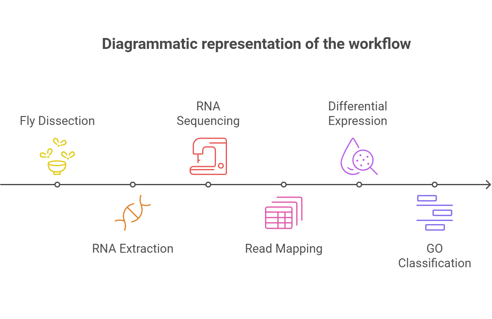
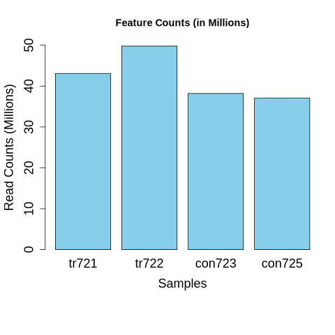
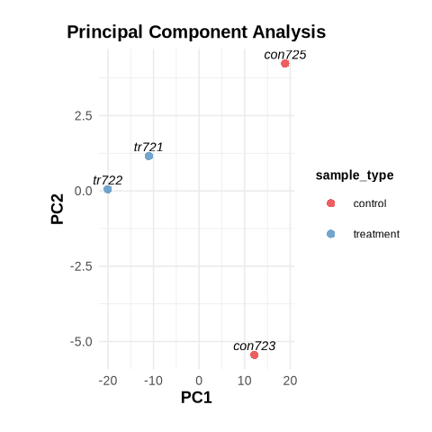
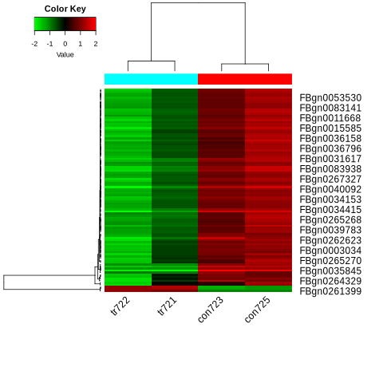
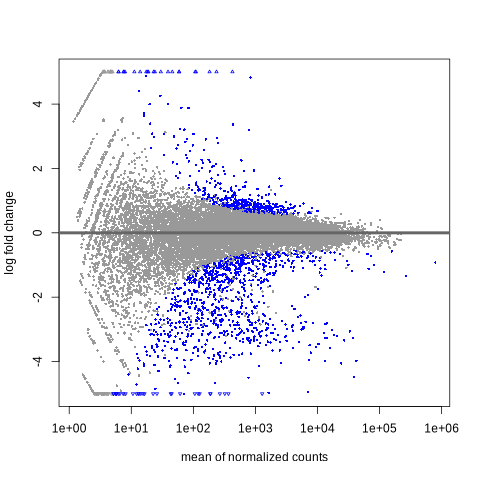
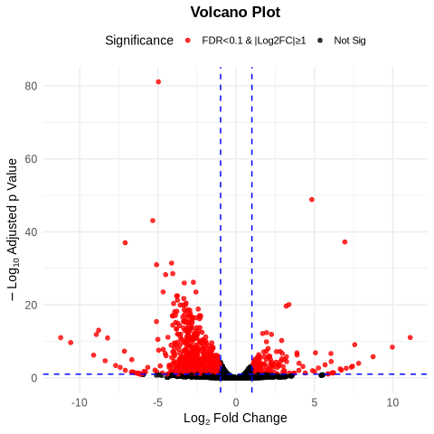

# RNA-seq analysis of Drosophila melanogaster adult testes overexpressing microRNA-2b-1

## Introduction

In this project, I focused on replicating the transcriptomic analysis presented in the paper [*A transcriptomic (RNA-seq) analysis of Drosophila melanogaster adult testes overexpressing microRNA-2b-1* by Manickam et al](https://doi.org/10.1016/j.dib.2022.108748). This study aimed to understand the role of the miR-2b-1 microRNA overexpression in testicular bulging and stem cell differentiation in *Drosophila melanogaster*. Leveraging RNA sequencing (RNA-seq) data, the authors identified key genes and pathways involved in this biological process, providing valuable insights into microRNA-mediated regulation in stem cells.

## Objective

This (self) project is carried out of curiosity, to reproduce the bioinformatics analysis of a published work. The project also aims to critically evaluate the reproducibility of published data while strengthening the understanding of bioinformatics tools and techniques.

## Methods

The original study used Illumina HiSeq to generate RNA-seq data followed by alignment of clean reads using RNA STAR and analysis of differential gene expression with edgeR, using Galaxy Version 22.05. Gene ontology (GO) enrichment was performed to classify biological processes, cellular components, and molecular functions.

*Fig1. Step-by-step illustration of the RNA-Seq experiment, including Fly Dissection, RNA Extraction, RNA Sequencing, Read Mapping, Differential Expression Analysis, and Gene Ontology (GO) Classification.*

For my reproduction, I followed a similar workflow but implemented some differences:

0. **Set Up**: First, I created a separate conda environment (rna_seq) for this project and installed all dependencies. The code for the project setup is [available at housekeeping.md](scripts/housekeeping.md).

    If you are trying to reproduce the work, I highly recommend recreating the same conda environment in your device following this step:

        git clone https://github.com/poudelmohit/drosophila-testes-rna-seq.git
        cd drosophila-testes-rna-seq
        conda env create -f metadata/environment.yml
        conda activate rna_seq
        
    Though original work have used [total 6 samples](https://www.ncbi.nlm.nih.gov/Traces/study/?query_key=4&WebEnv=MCID_677a81b8e0f1d1140b4b7425&o=acc_s%3Aa), I selected only 4 samples (2 control and 2 treatment) due to computational limitations. The SRA ids of the 4 samples are listed [in this file](raw_data/SRR_Acc_List.txt)

1. **Preprocessing**: Downloaded raw data from GEO (accession number GSE211399) and processed it using `fastqc` to assess quality. Reference genome files were retrieved from Ensembl, and alignment was performed with `STAR`, producing sorted BAM files. Feature Counts were genarated from sorted BAM files of all samples using `featureCounts` function of `subread` bioconda package. All the codes for this step can be accessed from [scripts/preprocessing.md](scripts/preprocessing.md)

2. **Differential Expression Analysis**: I used DESeq2 for differential expression analysis instead of edgeR. Feature counts from BAM files were merged into a single [CSV file](output/counts/merged_counts.csv) for downstream analysis. 

    

    *Fig2: Normalized feature counts for overexpressed (tr721 and tr722) and control (tr723 and tr725) samples.*

3. **Visualization**: I created heatmaps, PCA plots, MA plots, and volcano plots to visualize the results. These provide clear insights into sample clustering, gene expression distributions, and significantly differentially expressed genes (SDEGs). All the plots are saved into [output/plots/](output/plots/)

---

## Results

The analysis highlighted several key findings:

1. **PCA Plot**: Principal Component Analysis (PCA) showed distinct clustering of the treatment and control groups, reaffirming clear differences in gene expression profiles.

    

    *Fig3. Principal Component Analysis (PCA) Plot: Visualization of sample clustering using the top 500 features by variance. Treatment samples (tr721, tr722) cluster distinctly from control samples (con723, con725) along PC1, highlighting significant differences in gene expression profiles between the groups.*

2. **Heatmap**: The hierarchical clustering heatmap illustrates the separation between control and treatment groups based on top variable genes. Genes are clearly upregulated or downregulated in response to miR-2b-1 overexpression.

    

    *Fig4. Heatmap of Differential Gene Expression: Comparison of Overexpressed Samples (tr722, tr721) vs. Control Samples (con723, con725). Red indicates upregulated genes, green indicates downregulated genes, and hierarchical clustering reveals distinct expression patterns between the experimental and control groups*

3. **MA Plot**: The MA plot visualized log-fold changes and revealed hundreds of SDEGs under an FDR of 0.1.

    

    *Fig5. MA Plot: Visualization of differential gene expression, displaying the log2 fold change (y-axis) against the mean of normalized counts (x-axis). Blue points represent significantly differentially expressed genes, highlighting changes between treatment and control conditions*

4. **Volcano Plot**: Highlighted significantly upregulated and downregulated genes, with stringent cutoffs for log2 fold change and adjusted p-values. This plot emphasizes the miR-2b-1 impact on gene expression.

    
    
    *Fig6. Volcano Plot: Representation of differential gene expression with log2 fold change (x-axis) and -log10 adjusted p-value (y-axis). Dashed line mark significance thresholds.*

5. **GO Enrichment**: Biological processes such as DNA repair, regulation of immune response, and cellular differentiation were significantly enriched. Cellular components and molecular functions aligned with previously reported findings on microRNA involvement in stem cell regulation.

---

## Discussion

This reproduction confirms key findings of the original paper, including the impact of miR-2b-1 overexpression on differential gene expression and enriched biological pathways. However, some differences in statistical analysis and toolsets might have influenced subtle variations in results. Moving forward:

- **Improved Data Integration**: Incorporating additional datasets could provide broader context.
- **Comparative Analysis**: Comparing edgeR and DESeq2 results may enhance understanding of analysis discrepancies.
- **Functional Validation**: Experimental validation of identified genes would further corroborate computational findings.

By bridging computational reproducibility with biological insights, this project reinforces the role of miRNAs in developmental biology and provides a robust framework for future studies.

## Acknowledgment

I would like to thank the authors of the original paper for their work, which served as the foundation for this project. I am also deeply grateful to [**Alavarado-Serrano Lab, Ohio Univesity**](https://alvarado-s.weebly.com) for providing the necessary computing resources that made this work possible.
    

## Final Note

This project is just an attemp from a bioinformatics novice, performed out of curiosity. As such, it may contain erros or areas of improvement. Constructive feedbacks and suggestions are highly appreciated. Please feel free to [reach out to the author](https://poudelmohit.github.io/#contact) if you have any suggestions or even for a casual coffee chat.

[**Complete GitHub Repository of the Project**](https://github.com/poudelmohit/drosophila-testes-rna-seq)